# 一、研究背景
长期以来，表格数据的预测大多数是由XGBoost、LightGBM等树模型统治，虽然他们比较擅长捕捉数值之间的相关关系，但本质上是讲特征视为冷冰冰的数值，这意味着当模型处理“年龄”和“月收入”时，没办法感知这俩词汇背后深刻的社会学含义，这样就会导致大量本可以指导决策的先验知识在进入模型之前就被剥离和浪费了。

随着大语言模型的崛起，研究者们开始尝试将“语义推理”引入表格预测，LLM凭借预训练阶段积累的世界知识，能够洞察文字描述与业务标签之间的深层逻辑联系，处理传统机器学习难以应付的稀疏数据和冷启动场景时，展现出了极强的潜力。
本文旨在系统性地梳理 LLM 在表格数据预测领域的最新进展，并将当前业界的主流研究路径归纳为以下四个维度（如下表所示）

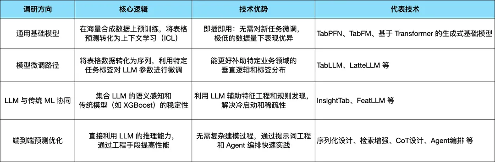

# 二、  相关研究
## 1. 通用基础模型：TabPFN - 表格数据的Transformer
### 1.1 核心思想
> 不是在训练模型，而是在“拟合算法”

传统机器学习（如 XGBoost）的逻辑是：拿到数据 → 训练迭代 → 预测。而 TabPFN 的逻辑是：监督学习任务本身看作一个推理问题，类似于 GPT，TabPFN 将整个训练集作为“上下文”输入，预测测试集的标签。

这意味着它在面对新数据时不需要重新训练（Zero-shot），仅需一次前向传播即可完成分类。所以训练的时候，TabPFN也是和GPT训练的时候类似，把数据集和标签一起丢进给模型训练，由于真实世界的表格数据集数量有限且存在偏见，TabPFN 在预训练阶段完全使用合成数据。它定义了一个极其复杂的“先验（Prior）”，利用结构因果模型（SCM）和贝叶斯神经网络（BNN）随机生成数百万个不同的表格任务，让模型在这些任务中学会识别通用的特征模式。
> 复杂先验、因果模型、贝叶斯神经网络这些都是文章中原文内容，有点难以理解。
> 我的理解是我们人为设定在特征和标签之间存在一种因果关系，这种因果关系是随机的但逻辑是严密的，然后利用贝叶斯神经网络通过随机采样权重给特征和标签之间注入更具挑战性的非线性扰动，这样模型就有一个逻辑自洽但是形态各异的数据库，由于TabPFN在预训练阶段已经见过了这些远比现实数据更变态更复杂的数学规律，回头处理现实中那些真正存在潜在的因果关系的真实任务时，就是小菜一碟。
### 1.2 模型架构

TabPFN 在架构上基于 Transformer 编码器（Encoder），但为了适配表格数据的特性（无序性、异构性），进行了以下关键设计：
- 无位置编码：表格的行与行之间、特征与特征之间（在未指定顺序时）通常是无序的。TabPFN 舍弃了 Transformer 常用的位置编码，确保模型对样本顺序和特征顺序具有不变性。
- 双向注意力机制：传统 Transformer 模型在处理表格数据时，将表格数据扁平化为序列（只进行了 1D 的 feature attention），忽略了表格固有的样本（行）和特征（列）的组织方式；所以采用双向注意力机制，行内注意力用于捕捉样本内部不同特征之间的关联（如下左图 1D feature attention），列间注意力用于学习同一特征在不同样本之间的模式（如下左图 1D sample attention）。
- 分类输出层：网络的输出端是一个针对测试样本的分类头（Softmax），它根据提取到的全局上下文信息，直接预测测试样本属于各类的概率。
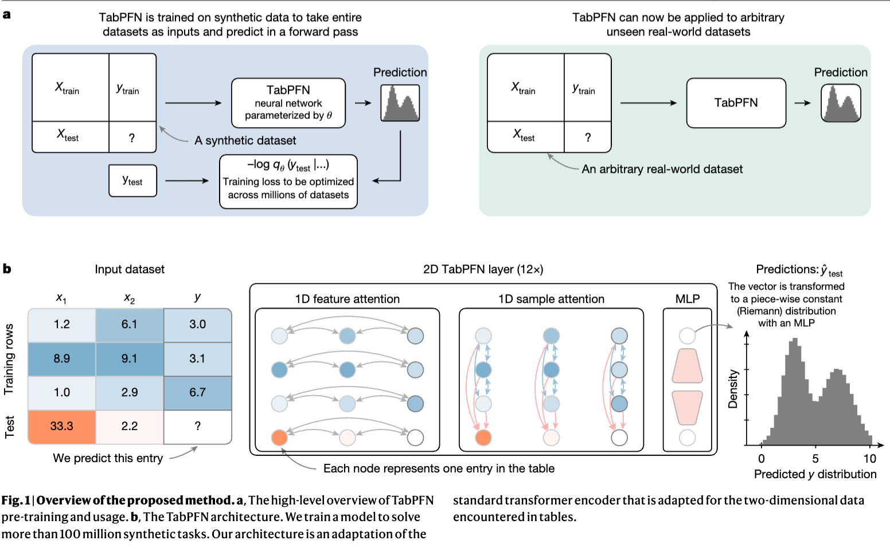
### 1.3 优势与局限

**优势：**通过在大规模合成数据上预训练一个Transformer作为通用学习算法，TabPFN实现了对中小型表格数据（≤10,000样本）的秒级精确预测，其性能可超越经过数小时调优的传统方法（如梯度提升树），并内置了概率预测、数据生成和可解释性等基础模型能力。

**局限：**然而，其性能增益主要集中在中小规模任务，面对超大规模样本或极度非平滑的回归问题时，传统方案仍具优势。受限于架构特性，其内存占用随样本量显著上升，且底层理论框架尚需完善。而且，作为深度模型，它在决策透明度上仍存在‘黑盒’特征，无法满足对强解释性有严格要求的业务需求。

## 2. 模型微调路径：TabLLM

### 2.1 核心思想

将表格行数据（包括特征名和特征值）通过序列化函数转化为自然语言字符串，并与任务描述提示词结合，形成LLM的输入。该方法充分利用了LLM预训练时编码的广泛先验知识，在零样本和少样本场景下表现优异。在少样本设定中，采用参数高效的T-Few方法对LLM进行微调，以适配特定任务。为了从LLM的文本生成输出中得到分类结果，该方法使用手动指定的Verbalizer将输出词汇（如“是/否”）映射到类别标签，并通过计算LLM生成这些对应词汇序列的概率，经归一化后得到最终的类别预测置信度。
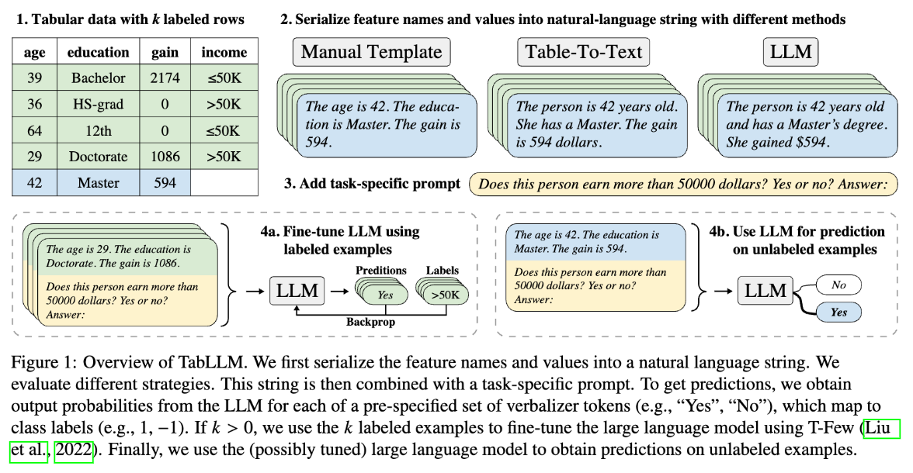

### 2.2 序列化策略对比

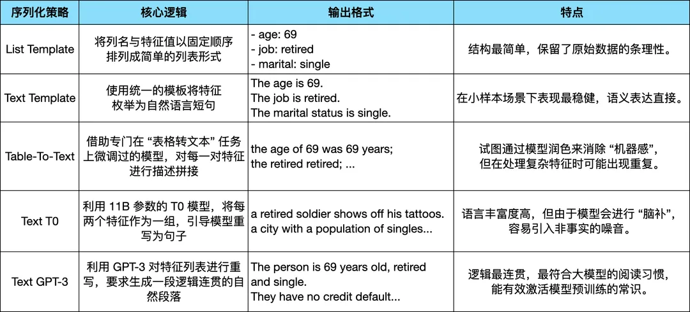

### 2.3 微调与置信度设计

在实际实验中，Text Template的序列方法在小样本场景下表现更出色，针对这一现象，研究采用了T-Few参数高效的微调方法，重点测试了样本量从0到512的微调效果，结果发现，在极小样本下（n<512）,序列化方法对模型性能有决定性影响，而一旦样本量突破 512，各类序列化方法的效果便趋于一致。这说明序列化设计能够弥补样本量不足的缺陷，但在“冷启动”或“样本稀缺”场景下，精准的语义描述依然是性能的杀手锏。

此外，在TabLLM中，模型输出的置信度（即预测概率）并非直接由大模型给出，而是通过特定的计算方式获得。具体来说，模型会基于序列化后的输入语句，分别计算输出“Yes”和“No”这两个对应类别词语的概率，然后将这两个概率进行归一化处理，最终得到模型对每个类别的分类置信度。这种方法有助于减少大模型自身可能产生的幻觉问题，提高预测的可信度。
### 2.4 结论

在9个公开表格数据集和3个大型医疗索赔数据集上进行了评估，关键结论
1.  零样本能力：TabLLM在大多数数据集上实现了较高的零样本性能（AUC > 0.5），证明了LLM先验知识的有效性。
2.  少样本优势：在极少样本（通常少于256个样本）设置下，TabLLM显著优于所有深度学习基线（SAINT, TabNet, NODE）和梯度提升树（XGBoost, LightGBM），与最强的TabPFN基线相当。

这篇文章虽然采用了微调的技术来预测表格数据，但对我们直接端到端预测数据还是很有启发，比如，序列化的设计和置信度的输出设计，不再依靠大模型直接给出，而是通过输出下一个token为“Yes”和“No”对应类别词语的概率。
### 2.5 优势与局限
**优势：**在训练数据极少（甚至为零）的情况下，TabLLM显著优于传统方法，尤其适用于标注数据稀缺的场景（如医疗罕见病预测）；充分利用先验知识，利用大语言模型中学过的领域知识，实现零样本推理；仅需简单的文本模板序列化表格，无需复杂的特征工程，就可以得到较为稳定的结果。

**局限：**计算成本高，微调和推理需要大型GPU；语言模型的token限制可能导致高维特征被截断，影响性能；若列名或特征值未在语言模型预训练语料中出现（如专业基因名），性能会下降，依赖语义可解释性。

## 3.   LLM 与传统 ML 合作：InsightTab框架 和 FeatLLM

### 3.1 InsightTab 框架

#### 3.1.1 核心思想

本文提出了一种名为 InsightTab 的创新框架，旨在弥合大语言模型（LLM）通用知识与特定任务之间的鸿沟。其核心思想是：通过数据驱动的洞察提炼，将有限的训练数据“蒸馏”成可操作的自然语言规则和示范样本，并将这些“洞察”整合到提示词中，从而弥合LLM的通用知识与特定表格任务之间的差距。该方法借鉴人类学习的三大原则（分而治之、易为先、反思学习）。
#### 3.1.2 具体步骤

1.  分而治之：将样本通过聚类的方法划分成高相似度的子集；先训练一个xgboost模型，使用模型中第一棵决策树当做分组的基础，样本根据他们在第一棵树中叶节点中的归属进行分组，落入同一个叶节点的样本，意味着它们在前几个最重要的特征上遵循了相同的分割规则，因此具有较高的局部相似性。
2.  规则总结与合并：将每个分组的数据输入给一个强大的LLM，让其总结出该分组的分类规则。然后将所有分组的规则合并、去重，得到全局规则集。
3.  先易后难：利用XGBoost模型预测的熵值，对训练样本进行排序。选择熵值最低的样本作为“简单”示范，熵值最高的样本作为“困难”样本。
4.  反思学习与规则增强：让预测LLM使用当前的规则和“简单”示范对“困难”样本进行预测。将预测错误的样本收集起来，再次送入总结LLM生成新的规则，用以增强现有规则集。

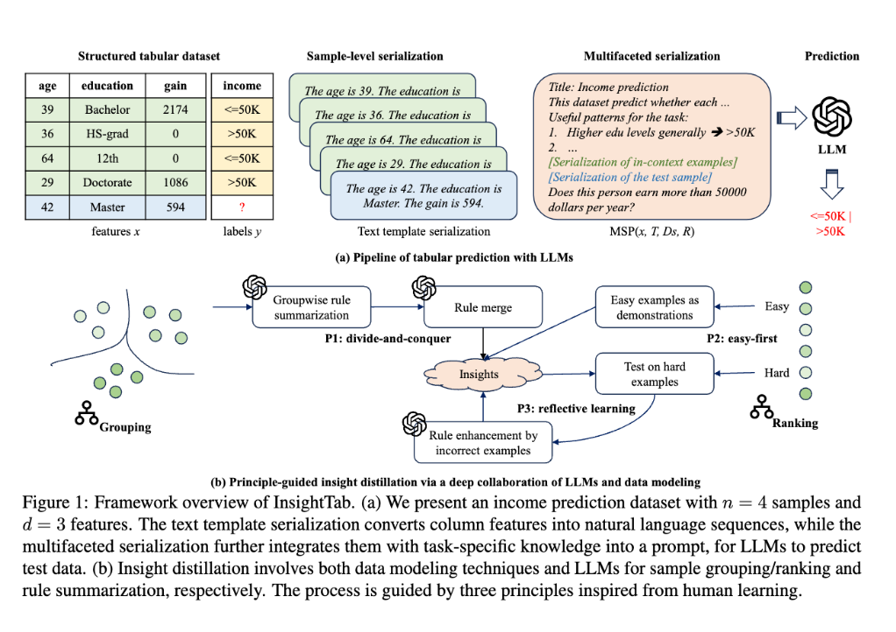

#### 3.1.3 提示词工程

InsightTab 最终生成的 Prompt 是高度结构化的，它将所有提炼出的洞察整合在一起：

[任务标题]：定义业务边界 --> [业务规则总结]：注入 LLM 提炼出的全局逻辑 --> [少量镜头示例]：提供简单的参考基准 --> [待预测数据]：进行最终的语义推理

下面是 InsightTab 的一个提示词案例
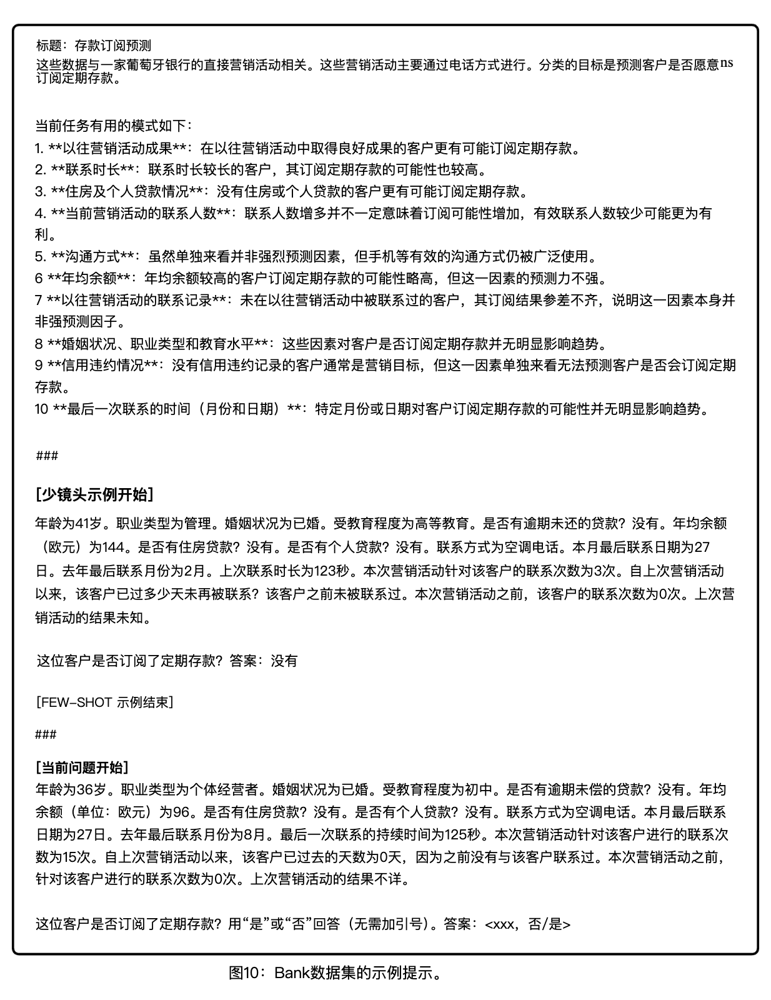
#### 3.1.4 优势与局限

**优势：**通过将训练数据蒸馏为可操作的规则，可以弥补 LLM 与特定表格任务之间的知识鸿沟。在9个小样本（<=256个样本）数据集上的实验表明，其平均性能显著超越了包括XGBoost、TabPFN及其他先进LLM方法在内的所有基线模型。该方法能有效缓解 LLM 对特征位置顺序的依赖，并在类别不平衡的数据集上取得更平衡的预测结果。

**局限：**其两阶段推理过程（规则总结与预测）会产生额外的计算开销，该方法的核心优势在于少样本场景；当拥有充足训练数据时，传统方法（如XGBoost）仍然更有效；与其他LLM评估工作一样，存在测试数据在预训练阶段已被模型见过的风险（数据污染），这可能导致性能高估。

### 3.2 FeatLLM 

#### 3.2.1 核心思想

本文的核心思想是转变大语言模型（LLM）在表格学习中的角色，从直接进行端到端预测的“黑盒”模型，转变为自动化的特征工程师。其目标是利用LLM的先验知识和上下文学习能力，从少量样本中提取出用于分类的判别性“规则”，并将这些规则转化为新的二进制特征。然后使用一个简单的下游机器学习模型（如线性回归）基于这些新特征进行预测。这种方法旨在实现高性能的少样本学习，同时显著降低推理时的计算成本和延迟。
#### 3.2.2 具体步骤

1.  规则提取：输入[ 任务描述、特征描述（名称、类型、定义）和少量标记的示例样本。] ,使用结构化提示，引导LLM执行两步推理，最终为每个答案类别生成固定数量（如10条）的规则（条件语句）。
2.  特征生成：将上一步得到的规则文本，通过另一个LLM调用，自动转换为Python函数代码。该函数接收原始数据框，输出一个新的二进制数据框，其中每列对应一条规则是否被满足。
3.  模型建立：使用生成的二进制特征，训练一个简单的线性模型，模型学习每条规则（特征）对于每个类别的重要性权重，通过加权和与Softmax函数计算样本属于各个类别的概率。
4.  Bagging：每次重复时，通过设置LLM温度、打乱示例顺序、以及对特征或样本进行装袋采样，引入随机性以生成多样化的规则集和模型。
5.  集成预测：对于测试样本，使用所有训练好的线性模型分别进行预测，并对它们的预测概率进行平均，得到最终的集成预测结果。
6.  推理：在推理时，只需将测试数据通过所有生成的规则函数转换为二进制特征，然后输入到集成好的线性模型中即可，无需再次调用LLM。
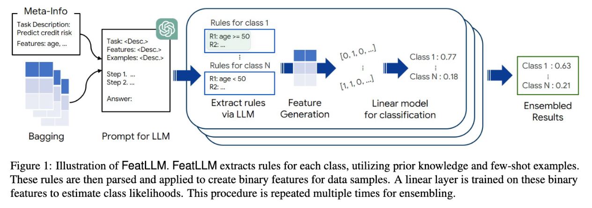
#### 3.2.3 核心优势

1.  与现有方法（如TabLLM、In-context Learning）需要为每个测试样本调用LLM进行预测不同，FeatLLM仅在训练阶段使用LLM生成一次特征规则。在推理时，完全依赖生成的特征和简单模型，无需再次查询LLM，从而大幅降低了推理成本和API依赖。
2.  设计了专门的两阶段提示模板，引导LLM：（a）首先基于常识分析特征与任务的关系；（b）然后结合少样本示例，为每个类别生成具体的判别规则。这种结构化的“思维链”有助于LLM聚焦于重要特征。
3.  通过多次运行流程并进行集成，并结合特征Bagging，来增强鲁棒性、引入多样性，并有效克服了LLM提示的长度限制，使其能够处理特征数量众多的表格数据。
#### 3.2.4 优势与局限

**优势：**将LLM用作特征工程师而非直接预测器，从而显著降低推理成本（无需对每个样本进行LLM查询），仅需API访问无需训练，并通过集成和特征装袋克服了提示长度限制，使其能处理特征数多的真实表格数据。

**局限：**目前仅专注于少样本学习，尚未扩展到大规模样本场景；生成的特征类型较为单一（主要是规则）；且其性能依赖于LLM的先验知识，可能引入社会偏见或错误信息，影响预测可靠性。
### 3.3 InsightTab 和 FeatLLM 的联系与区别

他们**共同点**在于：两种方法都利用 LLM 的语义推理能力，将枯燥的表格数值转化为可理解的判别规则，从而解决小样本场景下的语义缺失问题。

其**核心区别**在于执行链路：
- InsightTab 属于“端到端推理”模式，即大模型在预测时需要实时读取规则并对每一个样本进行逻辑推导，虽然推理深度高、解释性强，但面临极高的推理成本和延迟；
- FeatLLM 则属于“自动化特征工程”模式，它将大模型提取的规则预先转化为一段编码特征（例如：若样本符合“年纪>50、收入低、体力劳动”等语义规则，则转化为 [1, 0, 1] 形式的特征），最后交由下游的简单模型完成预测。这使得它在保留大模型语义的同时，彻底解决了在线推理的高延迟问题，更具工业落地价值。

## 4. 端到端预测优化

#### 4.1 指令调整

核心逻辑是，我们要将业务逻辑（规则）作为上下文喂给模型，提出来两种生成指令的路径：
1.  专家/行业路径（医疗场景）：从公共健康网站和医学专业书籍中直接提取规则，这种方法利用了现成的、可解释的人类先验知识；
2.  建模路径：在全量训练集上先训练一个简单且可解释的小模型（例如线性回归、规则树），把这些枯燥的“if-else”逻辑转化为文本逻辑，然后利用LLM将生硬的逻辑重写成流程自然的段落，这样更符合大模型的阅读习惯；具体的流程如下图所示
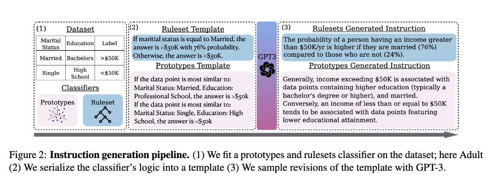
如图所示，针对收入水平（是否>50k）这个标签，先跑一个简单的分类模型，得到如果婚姻状况为“已婚”，那么有76%的概率，答案会是“大于5万美元”；否则，答案就是“小于5万美元”，然后通过GPT3转化为“与未婚人士相比，已婚人士的年收入超过5万美元的概率要高得多：已婚人士中，有76%的人年收入在5万美元以上，而未婚人士这一比例仅为24%” 这么一段LLM更擅长的自然语言。

为了大模型可以读懂表格，TABLET定义了一套严格的输入规范：
1. Prompt 标准模板：[任务标题] + [业务指令/规则描述] + [备选类别标签] + [精选示例(可选)] + [待预测数据点]
2. 数据序列化：采用 特征名: 特征值 | ... 的键值对格式，确保模型能精准对应特征含义。
3. 样本精选：不使用随机样本，而是通过 特征加权K近邻 算法，为每一个测试样本动态挑选最相似的参考样本。这种方法极大提升了 LLM 在少样本场景下的表现上限。
#### 4.2 RAG检索

核心思想是，不依赖于对LLM进行耗时的预训练或微调，而是充分利用LLM在表示、理解和推理方面的强大能力。通过将表格数据序列化并用LLM编码为向量表示，然后基于向量相似性从训练集中检索与目标未标记实例最相似的已标记实例，最后将这些检索到的实例作为Prompt与目标实例一同输入LLM，引导LLM进行类比推理，从而完成预测。
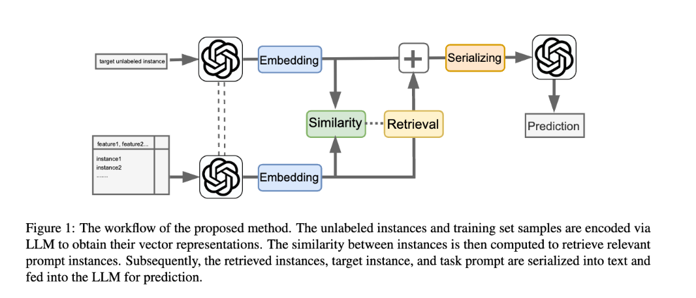
具体步骤：
1.  实例序列化和表示：将表格数据集中的每个样本转换为键-值对格式的文本序列，例如 {特征1: 值1, 特征2: 值2, ...}，针对 LLM 对原始浮点数（如 0.00345）不敏感的问题，将数值按分布划分为“高/中/低”等语义词。这相当于为模型提供了数值的“相对地位”，极大地辅助了逻辑推理。
2.  实例检索：计算目标实例向量与训练集实例向量的内积相似度，检索出相似度最高的K个有标签样本作为提示实例，实现动态 Few-shot。
3.  LLM预测：构建提示（Prompt），内容包括：任务描述、特征列表、标签类别、检索到的已标记实例、以及需要预测的目标待预测样本，将构建好的提示输入用于预测的LLM，指令其直接输出目标实例的预测类别。

#### 4.3 Agent编排

为了解决大语言模型在一些高风险表格数据决策任务中存在的“黑箱”问题，缺乏透明度、可控性和可审计性，提出一种结构化、角色化的多智能体辩论框架。该框架通过模拟法庭审判的对抗性辩论过程，将模型的内部推理清晰化，从而为决策提供可追溯、可解释的完整推理链条，以满足司法、医疗等高敏感领域对程序透明和人类监督的需求。
设计了包含检察官（主张高风险）、辩护律师（主张低风险）和法官（最终裁决）三个明确角色的多智能体系统，模拟了简化版的美国法庭审判流程。

| |
|:-:|
|任务：青少年再犯罪预测（二分类）|
|数据：使用NLSY97数据集，包含1412个案例，28个特征（人口统计学、教育、犯罪史等）。将表格数据转换为自然语言描述（如“性别是男性”）作为输入。|
|检察官开场陈述：基于案例事实，私下制定策略后公开主张被告会再犯。|
|辩护律师开场陈述：听取检方陈述后，私下制定策略并公开主张被告不会再犯。|
|法官初次信念更新：私下评估双方开场陈述，更新其内部信念（预测、置信度及理由）。|
|检察官反驳：针对辩护方论点进行私下策略规划和公开反驳。|
|辩护律师反驳：针对检方反驳进行私下策略规划和公开反驳。|
|法官中期信念更新：听取双方反驳后，再次私下更新信念。|
|检察官总结陈词：进行最终私下策略规划并公开总结。|
|辩护律师总结陈词：进行最终私下策略规划并公开总结。|
|法官最终裁决：进行最终信念更新，并输出公开的裁决（预测）、置信度和详细推理。此裁决即为框架的最终输出。|
AgenticSimLaw框架虽未显著提升绝对性能，但带来了更强的性能稳定性（准确率与F1分数相关性更高）和可解释性（完整辩论记录）。
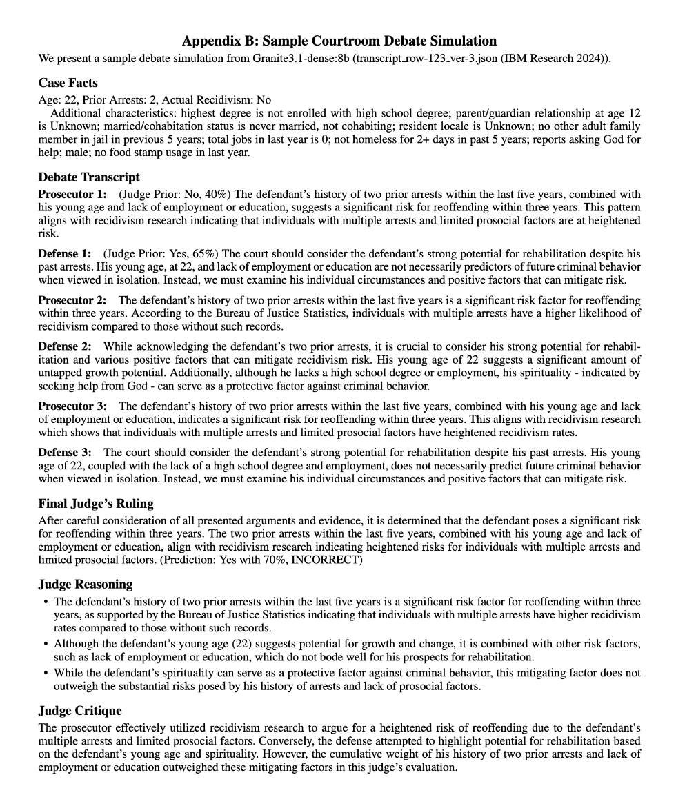
#### 4.4 端到端优化方法总结

经过上面的论文调研，我借鉴总结了一下在不微调模型的情况下，直接端到端的一些优化方法：
- 输入端：
	- **语义化与动态注入** ，利用表格数据自然语言化技术，将枯燥的数值转化为模型更易理解的语义描述。
	-  **RAG（检索增强生成）** ，实现“动态上下文 Few-shot”——不再喂给模型固定的例子，而是根据当前样本的特征，实时检索库中最相似的已标注案例，为模型提供最精准的类比参考。
- 推理层：
	- 逻辑增强与 Agent 协作 在 Prompt 设计中强制引入 **CoT（思维链）** 逻辑，引导模型进行分步推理。
	- 通过  **Agent 编排** 将复杂的任务链路拆解，让不同的智能体分别负责特定维度的推理，并引入“红蓝对抗”式的反驳求证机制。
- 输出端：不仅输出推理理由，还进行下一个 Token 的归一化概率计算。通过提取类别词（如“Yes/No”）的原始概率并进行归一化，我们能够得到精确的**分类置信度**。这不仅让预测结果可量化，更为计算 AUC、绘制 ROC 曲线等标准模型评估提供了数据支持。

# 三、  评估和总结
## 1. 实验评估
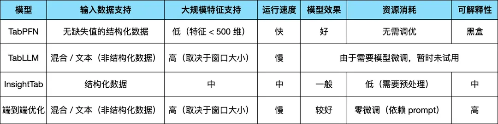

在小样本实战中，由于资源限制，我们未对需要模型微调的方法进行尝试，而是重点对比了上述三种“非微调”方案。

TabPFN 展现出了极强的建模能力：在给予 1000 个上下文样本后，其准确率达到 0.3860，尤其是在我们重点关注的类别识别上，F1 分数跑到了 0.4762，稳居第一。相比之下，InsightTab 的表现有点差，准确率只有0.2536 略胜于随机猜测。

我们综合了上一章总结的几种端到端的优化方法，在同样的小样本上进行测试，虽然它的准确率（0.3580）和重点关注的人群 F1 分数（0.4075）略逊于 TabPFN，但它提供了一个 TabPFN 无法替代的东西——决策透明度。TabPFN 虽强，但其他的推理逻辑封装在黑盒之中；而端到端方案通过思维链（CoT）输出了明确的推理路径。考虑到两者的性能差距在可接受范围内，LLM 方案在需要业务定性分析的场景下，显然更具落地吸引力。

---
## 2. 反思与总结
在调研的最后，我们确实需要冷静地审视 LLM 在表格领域的“双刃剑”特性：
> 读了这几篇论文，很难在文章里找到一个像样的公式，当那些可推导的复杂的公式被看不见摸不着的 LLM 逻辑给替代，严谨的统计空间慢慢向模糊的语义黑盒转变，总感觉少了一点“数学的安全感”，所以这种范式的转变到底是一种降维打击还是现代版的逻辑炼金术？
>
**优点：**
1.  LLM 能够利用先验知识理解“行业、职业、消费习惯”背后的深层逻辑；
2.  在极小样本甚至零样本场景下，展现出远超传统梯度提升树（GBDT）的冷启动处理能力；
3.  能够丝滑地处理表格中夹杂的备注、评价、图片等非结构化文本，无需繁琐的特征工程；
4.  通过思维链（CoT）和 Agent 辩论，将“黑盒预测”转化为“可解释的推理过程”；
5.  一旦构建好一套成熟的预测 Agent（如 Text2SQL + 语义推理路径），理论上只需调整目标指令即可快速推广至其他标签预测任务，这打破了传统机器学习“一个标签对应一套大规模建模流程”的开发模式。

**缺点：**
1.  相比本地毫秒级响应的树模型，LLM 巨大的参数量带来了极高的推理延迟和 API 调用成本；
2.  模型自带的互联网“记忆”可能带有社会偏见，在高风险决策中需要额外的合规校验；
3.  大模型有时并不完全听从指挥，或者在处理长表格时产生逻辑幻觉；
4.  在极度垂直的专业领域（如复杂的工业参数），通用大模型的常识可能失效，需要 RAG 或行业模型补充；

# 四、参考文献

1.  Hegselmann, S., Buendia, A., Lang, H., Agrawal, M., Jiang, X., & Sontag, D… (2023). TabLLM: Few-shot Classification of Tabular Data with Large Language Models. Proceedings of The 26th International Conference on Artificial Intelligence and Statistics, Proceedings of Machine Learning Research, 206, 5549-5581. [TabLLM: Few-shot Classification of Tabular Data with Large Language Models](https://proceedings.mlr.press/v206/hegselmann23a.html)
2.  Yuan, Y., Li, J., Zhang, W., Aliannejadi, M., Kanoulas, E., & Hu, R. (2025). Summarize-Exemplify-Reflect: Data-driven Insight Distillation Empowers LLMs for Few-shot Tabular Classification. *Findings of the Association for Computational Linguistics: EMNLP 2025*, 12324-12348. Suzhou, China: Association for Computational Linguistics.  [https://aclanthology.org/2025.findings-emnlp.659/]/](https://aclanthology.org/2025.findings-emnlp.659/](https://aclanthology.org/2025.findings-emnlp.659/)
3.  Han, S., Yoon, J., Arik, S. O., & Pfister, T. (2024). Large Language Models Can Automatically Engineer Features for Few-Shot Tabular Learning. *arXiv preprint arXiv:2404.09491*.  [[2404.09491] Large Language Models Can Automatically Engineer Features for Few-Shot Tabular Learning](https://arxiv.org/abs/2404.09491)
4.  Slack, D., & Singh, S. (2023). TABLET: Learning From Instructions For Tabular Data. *arXiv preprint arXiv:2304.13188*. [[2304.13188] TABLET: Learning From Instructions For Tabular Data](https://arxiv.org/abs/2304.13188)
5.  Wu, J., & Hou, M. (2025). An Efficient Retrieval-Based Method for Tabular Prediction with LLM. *Proceedings of the 31st International Conference on Computational Linguistics*, 9917-9925. Abu Dhabi, UAE: Association for Computational Linguistics.  [An Efficient Retrieval-Based Method for Tabular Prediction with LLM - ACL Anthology](https://aclanthology.org/2025.coling-main.663/)
6.  Chun, J., Elkins, K., & Lee, Y. S. (2026). AgenticSimLaw: A Juvenile Courtroom Multi-Agent Debate Simulation for Explainable High-Stakes Tabular Decision Making. *arXiv preprint arXiv:2601.21936*.       [[2601.21936] AgenticSimLaw: A Juvenile Courtroom Multi-Agent Debate Simulation for Explainable High-Stakes Tabular Decision Making](https://arxiv.org/abs/2601.21936)
